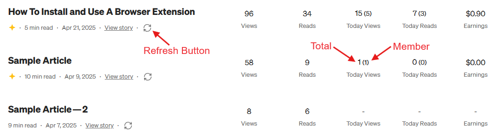

# Medium Stats Enhancer

Enhances Medium's stats page by adding real-time "Today Views" and "Today Reads" information for each story.
The extension seamlessly adds today’s statistics to your Medium stories without altering the page layout.

> ⚠️ **Disclaimer:** This tool is unofficial and not affiliated with Medium. It only reads publicly available data from your own account for convenience.

## ✨ Features

-   Adds **Today Views** and **Today Reads** columns to your Medium stats page.
-   Fetches and updates the data in real-time without refreshing the page.
-   Lightweight and integrates smoothly with Medium's original design.



## 📦 Project Structure

```
medium-stats-enhancer/
├── src/
│   ├── main.js               # Entry point
│   ├── images/
│   │   └── screenshot.png
│   ├── models/
│   │   └── result.js
│   └── modules/
│       ├── extend.js
│       ├── fetch-stats.js
│       └── utilities.js
├── manifest.json
├── README.md
├── .editorconfig
├── .prettierrc
├── .prettierignore
└── .gitignore
```

## 🚀 Quick Start (Local Installation)
> Works in both **Chrome** and **Firefox** (Manifest V3 compatible)

### 1. Clone the repository
```
git clone https://github.com/ekin-ceylan/medium-stats-enhancer.git
cd medium-stats-enhancer
```

### 2. Install dependencies and build
```
npm install
npm run build
```

### 3. Load the extension

#### Firefox
1. Open Firefox and go to `about:debugging#/runtime/this-firefox`.
2. Click on **"Load Temporary Add-on"**.
3. Select the `manifest.json` file inside the downloaded folder.

> **Note:** This is a temporary installation. The extension will be removed when you close Firefox. You can reload it anytime through `about:debugging`.

#### Chrome
1. Open Chrome and go to `chrome://extensions/`.
2. Enable Developer mode (top right).
3. Click on **"Load unpacked"**.
4. Select the root project folder

## 📖 Usage

1. Go to your Medium Stats page: [`https://medium.com/me/stats`](https://medium.com/me/stats)
2. You will see new **Refresh** buttons added next to each story.
3. Click the button to fetch today's views and reads for that story.
4. It also fetches today's stats when the page first loads.

### Display Explanation

-   **Today Views:** _All Views (Member Views)_  
    Displays the total number of views today (including both members and non-members), with member views shown in parentheses.

-   **Today Reads:** _All Reads (Member Reads)_  
    Displays the total number of reads today (including both members and non-members), with member reads shown in parentheses.

## 🤝 Contributing

Contributions are welcome!

If you would like to contribute:

-   Please **fork** this repository.
-   Create a new branch for your changes.
-   Open a **Pull Request** describing your updates.

> For major changes, please open an issue first to discuss what you would like to change.

## 🛣️ Roadmap

-   Adding better error handling (retry on failure)
-   Chrome Web Store and Firefox Add-ons publication
-   RefreshAll Button

## 📜 License

MIT — feel free to use and modify this project.
Please attribute if you fork or extend it publicly.
