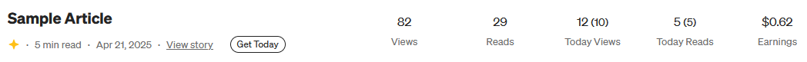

# Medium Stats Enhancer

Enhances Medium's stats page by adding real-time "Today Views" and "Today Reads" information for each story.

## Features

-   Adds **Today Views** and **Today Reads** columns to your Medium stats page.
-   Fetches and updates the data in real-time without refreshing the page.
-   Lightweight and integrates smoothly with Medium's original design.

## Installation

### Firefox

1. Clone or download this repository.
2. Open Firefox and go to `about:debugging#/runtime/this-firefox`.
3. Click on **"Load Temporary Add-on"**.
4. Select the `manifest.json` file inside the downloaded folder.

> **Note:** This is a temporary installation. The extension will be removed when you close Firefox. You can reload it anytime through `about:debugging`.

### Chrome

1. Clone or download this repository.
2. Rename `manifest.chrome.json` to `manifest.json`.
3. Open Chrome and go to `chrome://extensions/`.
4. Enable Developer mode (top right).
5. Click on **"Load unpacked"**.
6. Select the folder containing the updated manifest.json and content.js.

> **Note:** This project uses a separate manifest for Chrome (manifest v3). Be sure to rename `manifest.chrome.json` to `manifest.json` before loading.

## Usage

1. Go to your Medium Stats page:  
   [`https://medium.com/me/stats`](https://medium.com/me/stats)
2. You will see new **Get Today** buttons added next to each story.
3. Click the button to fetch today's views and reads for that story.

### Screenshot

> The extension seamlessly adds today’s statistics to your Medium stories without altering the page layout.

### Today Views and Today Reads Explained

-   **Today Views:** _All Views (Member Views)_  
    Displays the total number of views today (including both members and non-members), with member views shown in parentheses.

-   **Today Reads:** _All Reads (Member Reads)_  
    Displays the total number of reads today (including both members and non-members), with member reads shown in parentheses.

## Notes

-   Future plans include:
    -   Bulk fetching all today's stats automatically
    -   Exporting stats as CSV

## License

MIT License
